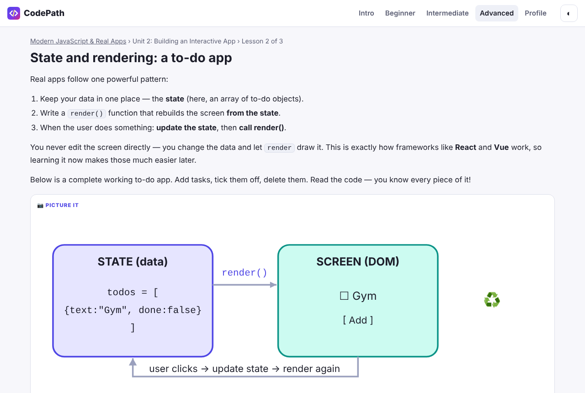
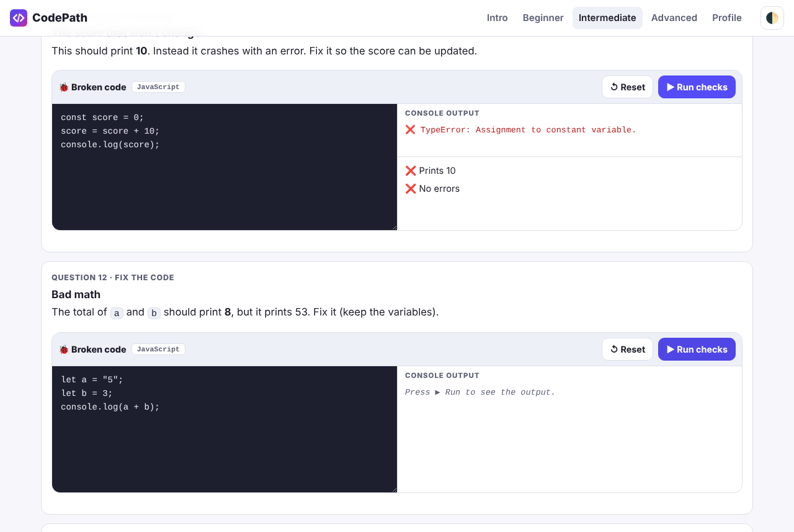
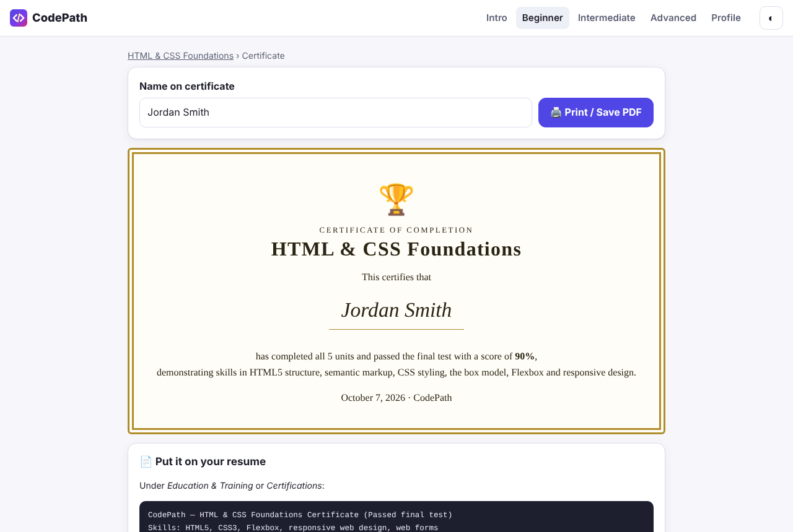

# CodePath — Learn to Code

An installable learn-to-code app for **phone and computer**. It teaches HTML, CSS and JavaScript through three courses, with illustrated lessons, a live code editor, pop quizzes and final tests that auto-grade your code.

**Live app:** https://manndrew85-source.github.io/codepath-learn-to-code/



## Features

- **3 courses × 5 units:** Beginner (HTML & CSS), Intermediate (JavaScript fundamentals), Advanced (modern JavaScript and real apps)
- **45 lessons**, each with a hand-drawn SVG diagram ("Picture it") and a live, editable code example
- **Live code editor** that runs HTML/CSS/JS safely in a sandboxed iframe, captures console output, and stops infinite loops
- **Unit recaps and pop quizzes:** score 60% or more to unlock the next unit
- **Final tests:** 10 multiple-choice + 10 "fix the broken code" questions per course, auto-graded by running the learner's code against test checks
- **Printable certificates** when a final test is passed with 70% or more
- **Progressive Web App:** installs to the home screen or desktop, works offline, light and dark mode, mobile-first layout
- Progress is saved locally in the browser (localStorage). No account or server is needed.



## Tech

Plain **HTML, CSS and JavaScript**, with no frameworks and no build step.

| File | Purpose |
|---|---|
| `index.html` | App shell and navigation |
| `js/app.js` | Hash router and all screens (home, lessons, recaps, quizzes, tests, certificates) |
| `js/runner.js` | Sandboxed code runner: console capture, loop guard, automated checks |
| `js/pics.js` | SVG diagram library, themed with CSS variables |
| `js/progress.js` | Progress saved in localStorage |
| `js/content/*.js` | Course content written as data (lessons, quizzes, tests) |
| `sw.js`, `manifest.webmanifest` | Offline support and app install |

## Run it locally

```bash
python3 -m http.server 8000
# open http://localhost:8000
```

Or open the folder in VS Code and use the **Live Server** extension.

## Deploy (GitHub Pages)

Go to repository **Settings → Pages → Deploy from a branch → `main` / root → Save**.

## Skills demonstrated

Responsive and accessible UI, a single-page app router, sandboxed code execution with `postMessage`, an automated grading engine, SVG graphics, PWA service-worker caching, and data-driven content design.


